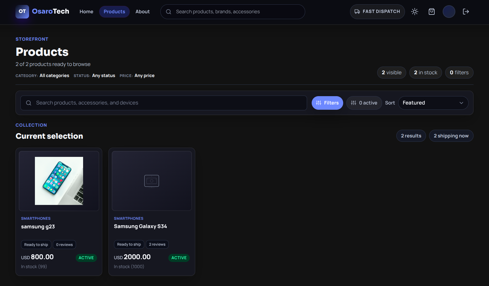

# OsaroTechStore

**Production-grade MERN e-commerce platform** — CQRS-style use-case separation, Stripe idempotency, Google OAuth, multi-stage Docker deployment.

[](#)
[](https://www.typescriptlang.org)
[](#)
[](#)
[](https://docker.com)
[](https://opensource.org/licenses/MIT)

---



---

## Key Achievements

- **329 tests passing** (229 backend unit/integration + 100 frontend component tests)
- **0 ESLint errors** across the entire codebase
- **Multi-stage Docker build** — 86% size reduction vs. single-stage (`1.2 GB → 168 MB` backend)
- **CQRS-style organization across all 6 modules** — use-cases split into `commands/` and `queries/` folders; payments extends this to full port-level separation
- **Idempotent Stripe integration** with retry-and-backoff — safe to retry failed payments
- **One-command deploy** — `docker compose up -d` starts the full stack with zero config
- **npm workspaces monorepo** — shared scripts across backend and frontend

---

## Tech Stack

| Layer              | Technology                                | Key Details                                                                   |
| ------------------ | ----------------------------------------- | ----------------------------------------------------------------------------- |
| **Frontend**       | React 18, React Router 6, Tailwind CSS    | CRA, lazy-loaded routes, context-based auth/cart state                        |
| **Backend**        | Node.js 24, Express 4, TypeScript 6       | Layered architecture (routes → controllers → services → repositories)         |
| **Database**       | MongoDB 7, Mongoose 8                     | Schema validation + `$jsonSchema`, compound indexes, soft-delete, migrations  |
| **Auth**           | JWT access tokens + Passport Google OAuth | 15-min token expiry, session rotation                                         |
| **Payments**       | Stripe Checkout                           | Idempotency keys, exponential backoff retry, idempotent webhook handling      |
| **Validation**     | Zod                                       | Request body/query/params validation middleware with typed errors             |
| **Logging**        | Pino                                      | Structured JSON, auto-redacted secrets (`token`, `secret`, `password`, `key`) |
| **API Docs**       | OpenAPI 3.0.3 + Swagger UI                | Versioned at `/api/v1/`, live at `http://localhost:5000/api-docs`             |
| **Infrastructure** | Docker Compose                            | 5 services, 2 isolated networks, health checks, resource limits, log rotation |

---

## Architecture Highlights

```
                    ┌─────────────┐
                    │   React SPA  │
                    │  (nginx:80)  │
                    └──────┬──────┘
                           │ /api/*
                    ┌──────▼──────┐
                    │   Express   │  CQRS (payments),
                    │   (API)     │  middleware pipeline,
                    └──┬──────┬───┘  Zod validation
                  /api |      | /api
              ┌───────▼──┐ ┌──▼────────┐
              │  MongoDB  │ │  Stripe   │
              │  + Redis  │ │ (external)│
              └───────────┘ └───────────┘
```

- **Layered backend**: routes → validation → controllers → services → repositories — testable in isolation
- **CQRS-style use-case separation**: all 6 modules separate `commands/` from `queries/` at the application layer; payments additionally splits the port interface into `paymentsCommandsPort` / `paymentsQueriesPort`
- **Idempotency**: Stripe checkout creation uses idempotency keys; webhooks deduplicate via `stripe-event-id` unique index
- **Graceful degradation**: missing Stripe/Google OAuth keys return `503` instead of crashing — safe for development

---

## Quick Start

```bash
git clone https://github.com/ousaro/OsaroTechStore
cd OsaroTechStore
docker compose up -d
# Opens at http://localhost
```

No env files, no installs, no config — all variables have dev-safe defaults. See [Docker section](#docker-compose) for Stripe, OAuth, and admin seeding.

---

## Project Structure

```
OsaroTechStore/
├── backend/          Express API (TypeScript, layered architecture)
│   ├── src/          Routes → validation → controllers → services → repositories
│   ├── tests/        Unit + integration tests (229 passing)
│   ├── migrations/   Database migrations
│   └── docs/         OpenAPI specification
├── frontend/         React SPA (100 component tests passing)
├── docs/             ADRs, architecture docs, functional/non-functional requirements
├── .github/          6 CI/CD pipelines
└── docker-compose.yml  Full-stack topology (5 services, 2 networks)
```

---

## Documentation

- [Functional Requirements](docs/functional-requirements.md) — 78 requirements across 8 modules
- [Non-Functional Requirements](docs/non-functional-requirements.md) — availability, security, observability, scalability
- [Architecture Decision Records](docs/adr/) — 6 ADRs covering DI, DB abstraction, validation, tooling
- [System Design](docs/architecture/backend-system-design-choices.md) — trade-offs, patterns, data flow
- [Data Model](docs/architecture/data-model.md) — ERD, indexes, migration strategy
- [Configuration Reference](docs/configuration.md) — all env vars, system collections

---

## Docker Compose

### 1) Zero-setup start

```bash
docker compose up -d
```

Opens at `http://localhost`. All env vars have built-in dev defaults — no files to create, no exports needed.

### 2) Customize with environment variables

Docker Compose reads vars from your shell or a root `.env` file. Pass them any of these ways:

```bash
# Method A — inline
TOKEN_SECRET=my-secret docker compose up -d

# Method B — root .env file (gitignored)
echo "TOKEN_SECRET=my-secret" >> .env && docker compose up -d

# Method C — shell export
export TOKEN_SECRET=my-secret && docker compose up -d
```

All overridable variables:

| Variable                      | Default                                 | For                 | Description                         |
| ----------------------------- | --------------------------------------- | ------------------- | ----------------------------------- |
| `TOKEN_SECRET`                | `dev-jwt-secret-not-for-production`     | Backend             | JWT signing key                     |
| `SESSION_SECRET`              | `dev-session-secret-not-for-production` | Backend             | Express session secret              |
| `ADMIN_EMAIL`                 | _(empty — no seed)_                     | Backend             | Auto-create admin on startup        |
| `ADMIN_PASSWORD`              | _(empty)_                               | Backend             | Admin password for auto-seed        |
| `STRIPE_SECRET_KEY`           | _(empty — payments disabled)_           | Backend             | Stripe API secret key               |
| `STRIPE_WEBHOOK_SECRET`       | _(empty)_                               | Backend, stripe-cli | Stripe webhook signing secret       |
| `GOOGLE_OAUTH_ENABLED`        | `false`                                 | Backend             | Enable Google OAuth                 |
| `GOOGLE_CLIENT_ID`            | _(empty)_                               | Backend             | Google OAuth client ID              |
| `GOOGLE_CLIENT_SECRET`        | _(empty)_                               | Backend             | Google OAuth client secret          |
| `GOOGLE_CALLBACK_URL`         | _(empty)_                               | Backend             | Google OAuth callback URL           |
| `PRODUCT_IMAGE_UPLOAD_URL`    | _(empty — local saves)_                 | Backend             | Object storage endpoint             |
| `PRODUCT_IMAGE_PUBLIC_URL`    | _(empty)_                               | Backend             | Public CDN URL for images           |
| `PRODUCT_IMAGE_UPLOAD_TOKEN`  | _(empty)_                               | Backend             | Upload auth token                   |
| `MONGO_ROOT_PASSWORD`         | `dev-mongo-password-123`                | MongoDB             | Root password (fresh volume only)   |
| `REACT_APP_STRIPE_PUBLIC_KEY` | `pk_test_key`                           | Frontend            | Stripe publishable key (build-time) |

### 3) Run with the features you need

```bash
# Just browse the store
docker compose up -d

# With admin auto-seed
ADMIN_EMAIL=admin@example.com ADMIN_PASSWORD=pass docker compose up -d

# With Stripe payments
STRIPE_SECRET_KEY=sk_test_xxx STRIPE_WEBHOOK_SECRET=whsec_xxx docker compose up -d

# With Stripe webhook listener (starts stripe-cli container)
STRIPE_SECRET_KEY=sk_test_xxx STRIPE_WEBHOOK_SECRET=whsec_xxx docker compose --profile stripe up -d

# With Google OAuth
GOOGLE_OAUTH_ENABLED=true GOOGLE_CLIENT_ID=xxx GOOGLE_CLIENT_SECRET=xxx GOOGLE_CALLBACK_URL=http://localhost/api/auth/google/callback docker compose up -d

# Everything at once via .env file
cat > .env << 'EOF'
TOKEN_SECRET=your-64-char-secret
SESSION_SECRET=another-random-secret
ADMIN_EMAIL=admin@example.com
ADMIN_PASSWORD=strong-password
STRIPE_SECRET_KEY=sk_live_xxx
STRIPE_WEBHOOK_SECRET=whsec_xxx
GOOGLE_CLIENT_ID=xxx.apps.googleusercontent.com
GOOGLE_CLIENT_SECRET=GOCSPX-xxx
GOOGLE_CALLBACK_URL=http://localhost/api/auth/google/callback
REACT_APP_STRIPE_PUBLIC_KEY=pk_live_xxx
EOF
docker compose up -d
```

### Rebuild and stop

```bash
docker compose up -d --build   # rebuild after code changes
docker compose down            # stop (add -v to delete volumes)
```

Full reference at [configuration.md](docs/configuration.md).

---

## Scripts

| Command             | Description                            |
| ------------------- | -------------------------------------- |
| `npm test`          | Run all 329 tests (backend + frontend) |
| `npm run lint`      | Lint entire monorepo (0 errors)        |
| `npm run build`     | Build all packages                     |
| `npm run typecheck` | TypeScript type checking               |
| `npm run format`    | Format with Prettier                   |

---

## Local Development

```bash
npm install                   # Installs backend + frontend via workspaces
# Terminal 1: cd backend && npm run dev     # Express with hot reload at :5000
# Terminal 2: cd frontend && npm start      # React dev server at :3000
# Terminal 3: cd backend && npm run migrate # Database migrations
```

---

## What I Would Add Next

- **Async job queue** — BullMQ for non-blocking payment processing, emails, image resizing
- **Redis caching** — cache product listings and sessions to reduce DB load
- **Full TypeScript migration** — extend shared kernel to all 6 backend modules
- **Circuit breaker** — opossum for Stripe and external calls to prevent cascading failures
- **Error tracking** — Sentry for production monitoring and alerting
- **Contract tests** — Pact tests for Stripe webhook integration
- **Cloud deployment** — Terraform + ECS/Fargate with staging environment and Prometheus alerting

---

## License

MIT — see `LICENSE`.
