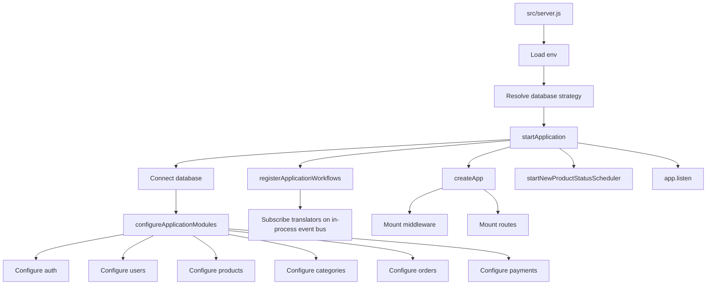
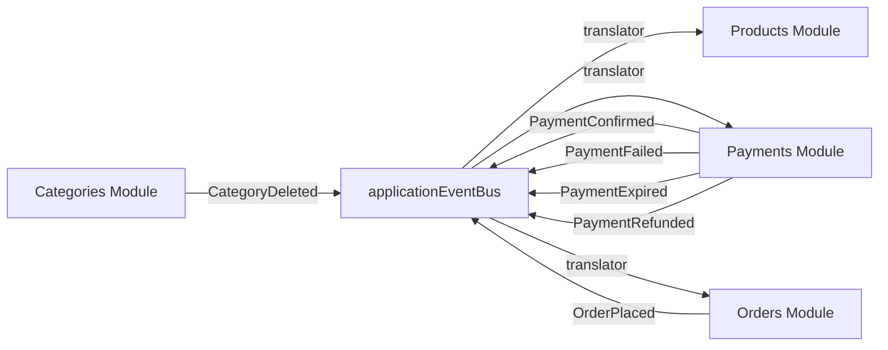
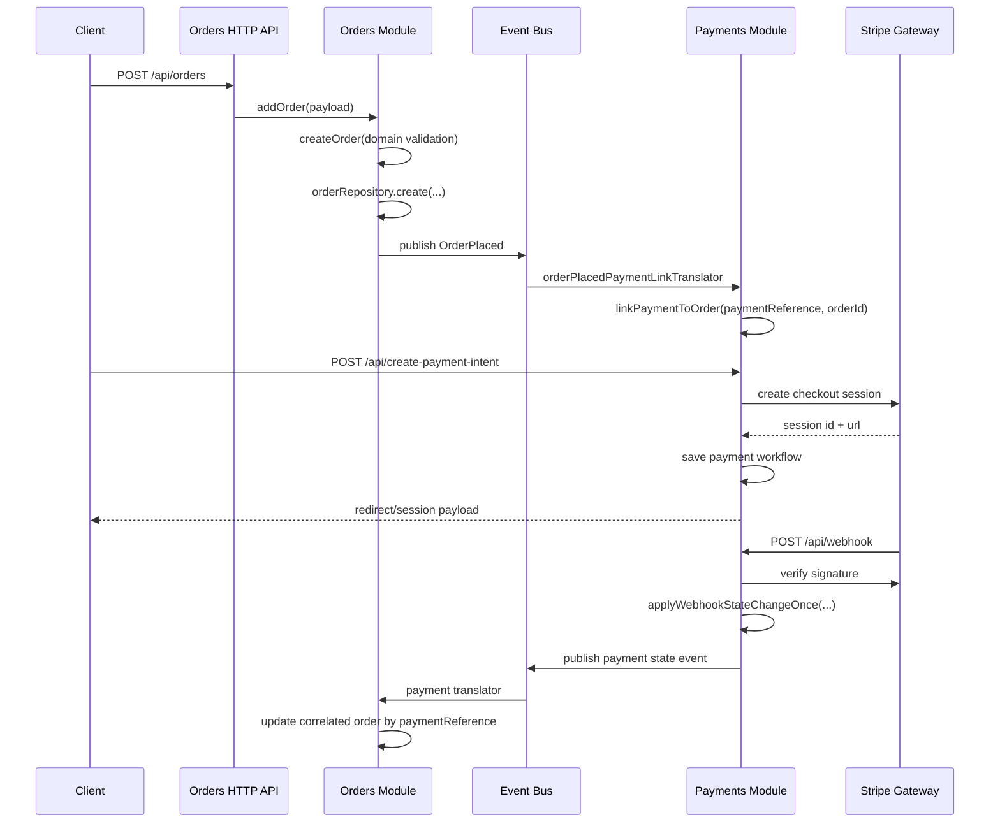
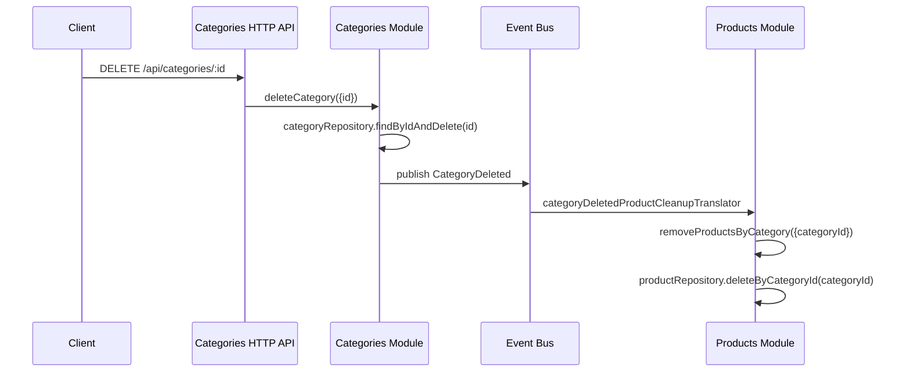
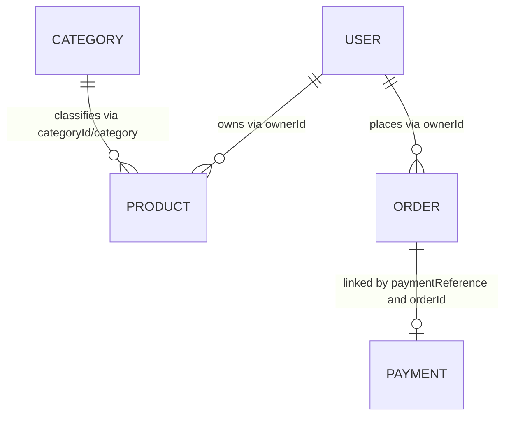

# Backend Architecture Analysis

This document maps the backend in `backend/` as it exists today. It covers:

- the full source structure
- the architectural style and layering rules
- HTTP and event-driven communication
- entity and persistence relationships
- module-by-module responsibilities

Scope note: this intentionally documents project code and configuration, not vendored dependencies in `backend/node_modules/`.

## 1. Backend Root Structure

```text
backend/
  .env
  .env.dev
  .env.prod
  .env.test
  docs/
    openapi.yaml
  package-lock.json
  package.json
  src/
    app/
    infrastructure/
    modules/
    server.js
    shared/
    tests/
```

## 2. Architecture Style

The backend follows a modular layered architecture with strong boundaries:

- `domain/`: business rules, value objects, domain entities, domain services, domain events
- `application/`: use cases, read models, DTOs, application errors, policies
- `ports/`: contracts for inbound and outbound dependencies
- `adapters/`: HTTP, schedulers, persistence, gateways, repository implementations
- `composition.js`: module composition root that wires use cases to ports/controllers
- `app-api.js`: application shell entrypoint for route/configuration access
- `public-api.js`: cross-module access point for collaboration workflows

Architecture rules enforced by tests in `src/tests/architecture/`:

- cross-module imports are only allowed through `public-api.js`
- the application shell imports modules only through `app-api.js` or `public-api.js`
- dependencies flow inward: `adapters -> ports/application/domain`, `application -> ports/domain`, `domain -> domain`
- module composition files must not construct concrete output adapters directly

## 3. Runtime Bootstrap

### Startup Flow



### Main Boot Files

- `src/server.js`: starts the app using environment config and a database strategy
- `src/app/startApplication.js`: orchestrates DB connection, module configuration, workflow registration, Express creation, runtime hooks, and server start
- `src/app/createApp.js`: builds the Express app, auth middleware, Swagger docs, and route mounting
- `src/app/registerApplicationWorkflows.js`: wires cross-module event translators
- `src/infrastructure/bootstrap/configureApplicationModules.js`: injects repositories, token service, payment gateway, event bus, and client URL into modules
- `src/app/applicationEventBus.js`: singleton in-process event bus

## 4. HTTP Surface

Mounted in `src/app/createApp.js`:

| Base Path | Module | Auth | Notes |
|---|---|---:|---|
| `/api/docs` | Swagger | No | Uses `backend/docs/openapi.yaml` |
| `/api/docs.json` | Swagger JSON | No | Raw OpenAPI document |
| `/api/users/auth` | Auth | No | Register, login, OAuth callbacks |
| `/api/users` | Users | Yes | User profile/admin-style operations |
| `/api/products` | Products | Yes | Product CRUD |
| `/api/categories` | Categories | Yes | Category list/create/delete |
| `/api/orders` | Orders | Yes | Order CRUD and payment-state synced updates |
| `/api/webhook` | Payments | No | Stripe raw webhook endpoint |
| `/api/create-payment-intent` | Payments | Yes | Starts checkout session |
| `/api/session-details/:sessionId` | Payments | Yes | Reads cached or provider-fetched session details |

### Route Breakdown

#### Auth

- `POST /api/users/auth/register`
- `POST /api/users/auth/login`
- `GET /api/users/auth/google`
- `GET /api/users/auth/google/callback`
- `GET /api/users/auth/github`
- `GET /api/users/auth/github/callback`
- `GET /api/users/auth/linkedin`
- `GET /api/users/auth/linkedin/callback`

Notes:

- Google can be enabled when configured.
- GitHub and LinkedIn currently resolve to unavailable handlers.

#### Users

- `GET /api/users/`
- `GET /api/users/:id`
- `PUT /api/users/:id`
- `PUT /api/users/passUpdate/:id`
- `DELETE /api/users/:id`

#### Products

- `GET /api/products/`
- `GET /api/products/:id`
- `POST /api/products/`
- `PUT /api/products/:id`
- `DELETE /api/products/:id`

#### Categories

- `GET /api/categories/`
- `POST /api/categories/`
- `DELETE /api/categories/:id`

#### Orders

- `GET /api/orders/`
- `GET /api/orders/:id`
- `POST /api/orders/`
- `PUT /api/orders/:id`
- `DELETE /api/orders/:id`

#### Payments

- `POST /api/webhook`
- `POST /api/create-payment-intent`
- `GET /api/session-details/:sessionId`

## 5. Cross-Module Communication

The backend uses two communication styles:

- synchronous HTTP calls into a single module
- asynchronous in-process domain/application events across modules

### Event Bus Topology



### Registered Workflow Subscriptions

Defined in `src/app/registerApplicationWorkflows.js`:

| Event | Source Module | Translator | Target Module | Effect |
|---|---|---|---|---|
| `CategoryDeleted` | Categories | `categoryDeletedProductCleanupTranslator` | Products | delete products for the deleted category |
| `OrderPlaced` | Orders | `orderPlacedPaymentLinkTranslator` | Payments | attach `orderId` to the payment workflow using `paymentReference` |
| `PaymentConfirmed` | Payments | `paymentConfirmedOrderSyncTranslator` | Orders | mark payment as paid and order status as paid |
| `PaymentFailed` | Payments | `paymentFailedOrderSyncTranslator` | Orders | mark order payment status as failed |
| `PaymentExpired` | Payments | `paymentExpiredOrderSyncTranslator` | Orders | mark payment failed and cancel still-pending orders |
| `PaymentRefunded` | Payments | `paymentRefundedOrderSyncTranslator` | Orders | mark refunded and cancel eligible orders |

### Order/Payment Lifecycle Sequence



### Category/Product Cleanup Sequence



## 6. Entity and Persistence Relationships

### Business Relationships



### Persistence Models

#### `UserModel`

Used by both the `auth` and `users` modules.

- identity: `_id`, `email`
- credentials: `password`
- profile: `firstName`, `lastName`, `picture`, `phone`, address fields
- user data: `favorites`, `cart`
- role: `admin`

Important design detail:

- `auth` owns direct persistence access to the user collection
- `users` does not touch Mongoose models directly for core profile/credential retrieval
- `users` goes through `auth`-backed account management functions exposed through `configureApplicationModules`

#### `ProductModel`

- `ownerId`
- product descriptive fields
- `categoryId`, `category`
- inventory: `countInStock`
- commerce metadata: `price`, `raw_price`, `discount`, `reviews`, `rating`, `salesCount`
- freshness tracking: `isNewProduct`, `lastSold`, `createdAt`/`listedAt`

#### `CategoryModel`

- `name`
- `description`
- `image`

#### `OrderModel`

- `ownerId`
- `products[]`
- `totalPrice`
- `status`
- `address`
- `paymentMethod`
- `paymentStatus`
- `paymentReference`

#### `PaymentModel`

- `paymentReference` unique business correlation id
- `providerWorkflowId` and `sessionId`
- optional `orderId`
- provider data: `provider`, `providerPaymentId`, `providerTransactionId`, `providerStatus`
- workflow metadata: `workflowType`, `url`
- payment lifecycle timestamps: `statusUpdatedAt`, `paidAt`, `failedAt`, `expiredAt`, `refundedAt`
- idempotency data: `processedWebhookEventIds`, `lastWebhookEventId`

### Correlation Keys

The most important correlation fields across the system are:

- `ownerId`: connects users to products and orders
- `categoryId`: connects categories to products
- `paymentReference`: connects orders to payments and is the main payment-event lookup key
- `orderId`: stored on payments after the `OrderPlaced` workflow links them

## 7. Shared Middleware and Infrastructure

### Shared HTTP Infrastructure

- `src/shared/infrastructure/http/asyncHandler.js`: async error wrapper
- `src/shared/infrastructure/http/createRequireAuthMiddleware.js`: resolves `req.user` through `verifyAccessToken`
- `src/shared/infrastructure/http/notFoundMiddleware.js`: 404 handling
- `src/shared/infrastructure/http/errorMiddleware.js`: centralized HTTP error mapping
- `src/shared/infrastructure/http/resolveHttpError.js`: application/domain error to HTTP response resolution
- `src/shared/infrastructure/http/validation.js` and `HttpValidationError.js`: validation helpers

### Shared Event Infrastructure

- `src/shared/infrastructure/events/createInProcessEventBus.js`
- `src/shared/application/contracts/applicationEventContract.js`

Behavior:

- validates event shape
- stores handlers by event type
- invokes subscribers sequentially with `await`
- returns unsubscribe functions from `subscribe`

### Infrastructure Providers

#### Database Strategies

`src/infrastructure/providers/databases/databaseStrategies.js`

- `mongo`: implemented, connects through Mongoose and builds repository bundle
- `postgres`: declared but not implemented
- `h2`: declared but not implemented

Repository bundle created for Mongo:

- `authUserRepository`
- `categoryRepository`
- `orderRepository`
- `paymentRepository`
- `productRepository`
- `userRepositoryFactory`

#### Payment Gateway Strategies

`src/infrastructure/providers/payments/paymentGatewayStrategies.js`

- `stripe`: implemented when secrets are configured
- `none`: unavailable stub strategy
- `paypal`: unavailable stub strategy

## 8. Module-by-Module Analysis

Each business module follows the same shape:

```text
module/
  adapters/
    input/
    output/
  application/
  domain/
  ports/
  app-api.js
  composition.js
  public-api.js
```

### 8.1 Auth Module

Purpose:

- register and log in users
- verify bearer tokens
- expose managed user/profile access used by the `users` module
- optionally expose Google OAuth

Important files:

- `src/modules/auth/composition.js`
- `src/modules/auth/adapters/input/http/authRoutes.js`
- `src/modules/auth/application/commands/registerUserUseCase.js`
- `src/modules/auth/application/commands/loginUserUseCase.js`
- `src/modules/auth/application/queries/verifyAccessTokenUseCase.js`
- `src/modules/auth/adapters/output/repositories/mongooseAuthUserRepository.js`
- `src/modules/auth/adapters/output/services/jwtTokenService.js`

Flow:

1. HTTP controller receives register/login request.
2. Input port calls application use case.
3. Application validates credentials policy.
4. Repository accesses `UserModel`.
5. JWT token service signs or verifies identity.
6. Controller returns an `AuthPrincipal`.

Domain concepts:

- `AuthCredentials`: registration/login commands
- `AuthPrincipal`: response projection sent back to clients
- `Email`: validated email value object

External integration:

- JWT
- Passport Google OAuth

### 8.2 Users Module

Purpose:

- query and update non-auth profile data
- update passwords
- delete users

Important files:

- `src/modules/users/composition.js`
- `src/modules/users/application/commands/updateUserUseCase.js`
- `src/modules/users/application/commands/updateUserPasswordUseCase.js`
- `src/modules/users/adapters/output/repositories/mongooseUserRepository.js`
- `src/modules/users/ports/output/authAccountAccessPort.js`

Special design:

- `users` is layered on top of auth-managed user access
- it uses `authUserManagement` functions injected at application bootstrap
- this keeps direct cross-module access explicit and centralized

Allowed profile update fields:

- `firstName`
- `lastName`
- `picture`
- `phone`
- `address`
- `city`
- `country`
- `state`
- `postalCode`
- `favorites`
- `cart`

Password update rule:

- if a user updates their own password, current password must match

### 8.3 Products Module

Purpose:

- CRUD for products
- related product lookup
- scheduled refresh of `isNewProduct`
- cleanup when categories are deleted

Important files:

- `src/modules/products/composition.js`
- `src/modules/products/domain/entities/Product.js`
- `src/modules/products/application/commands/refreshNewProductStatusUseCase.js`
- `src/modules/products/adapters/input/schedulers/newProductStatusScheduler.js`
- `src/modules/products/adapters/output/repositories/mongooseProductRepository.js`

Business rules:

- required product fields are validated in the domain entity
- final `price` is derived from `raw_price` and `discount`
- price and stock cannot be negative
- related products are found by shared category
- `isNewProduct` is recomputed from listing age

Cross-module input:

- listens indirectly to `CategoryDeleted` through the application workflow translator

### 8.4 Categories Module

Purpose:

- list, create, and delete categories
- publish deletion events for downstream cleanup

Important files:

- `src/modules/categories/composition.js`
- `src/modules/categories/domain/entities/Category.js`
- `src/modules/categories/domain/events/CategoryDeleted.js`
- `src/modules/categories/application/commands/deleteCategoryUseCase.js`

Business rules:

- `name`, `description`, and `image` are required
- deleting a category emits `CategoryDeleted`

Cross-module output:

- products are cleaned up after category deletion via the event bus

### 8.5 Orders Module

Purpose:

- CRUD for orders
- enforce order lifecycle rules
- react to payment state events
- publish `OrderPlaced`

Important files:

- `src/modules/orders/composition.js`
- `src/modules/orders/domain/entities/Order.js`
- `src/modules/orders/domain/services/orderLifecycleService.js`
- `src/modules/orders/domain/services/orderUpdatePolicyService.js`
- `src/modules/orders/application/commands/addOrderUseCase.js`
- `src/modules/orders/application/commands/updateOrderUseCase.js`

Core domain model:

- `Order`
- `Address`
- `Money`
- `OrderLine`
- `OrderStatus`
- `PaymentStatus`

Order status transitions:

- `pending -> paid | cancelled`
- `paid -> processing | cancelled`
- `processing -> shipped | cancelled`
- `shipped -> delivered`
- `delivered -> terminal`
- `cancelled -> terminal`

Update policies:

- immutable after placement: `ownerId`, `products`, `totalPrice`, `address`, `paymentMethod`, `paymentReference`
- paid-only statuses: `paid`, `processing`, `shipped`, `delivered` require `paymentStatus = paid`

Cross-module output:

- emits `OrderPlaced`

Cross-module input:

- handles `PaymentConfirmed`
- handles `PaymentFailed`
- handles `PaymentExpired`
- handles `PaymentRefunded`

### 8.6 Payments Module

Purpose:

- create checkout sessions
- cache and expose payment workflow state
- verify Stripe webhooks
- publish payment lifecycle events
- link payment workflows to orders

Important files:

- `src/modules/payments/composition.js`
- `src/modules/payments/adapters/output/gateways/stripeGateway.js`
- `src/modules/payments/application/commands/createPaymentIntentUseCase.js`
- `src/modules/payments/application/commands/verifyWebhookUseCase.js`
- `src/modules/payments/application/commands/linkPaymentToOrderUseCase.js`
- `src/modules/payments/domain/entities/PaymentWorkflow.js`
- `src/modules/payments/domain/events/createPaymentStateChangeEvent.js`

Business rules:

- checkout items must be a non-empty array
- each item must have valid name, price, and quantity
- payment workflow status is normalized to one of `pending`, `paid`, `failed`, `refunded`
- supported workflow type is currently `redirect_session`

Provider flow:

1. `createPaymentIntentUseCase` creates a Stripe checkout session.
2. The session is normalized into a `PaymentWorkflow`.
3. The workflow is saved in `PaymentModel`.
4. Webhooks are verified and normalized into a payment state change.
5. Repository applies the state change idempotently.
6. The module emits a corresponding payment event when a new webhook state was applied.

Idempotency rule:

- `applyWebhookStateChangeOnce` ignores webhook events already present in `processedWebhookEventIds`

## 9. Authentication and Authorization Flow

```mermaid
flowchart LR
  A[Request with Authorization header] --> B[createRequireAuthMiddleware]
  B --> C[verifyAccessToken use case]
  C --> D[JWT token service]
  D --> E[Extract user id]
  E --> F[Auth user repository findUserIdOnly]
  F --> G[req.user = {_id}]
  G --> H[Protected route handler]
```

Protected modules:

- users
- products
- categories
- orders
- payments session/payment-intent endpoints

Unauthenticated endpoints:

- auth routes
- Swagger routes
- Stripe webhook

## 10. Configuration Model

Environment loading lives in `src/infrastructure/config/env.js`.

Behavior:

- loads `.env`
- overlays environment-specific file based on `NODE_ENV`
- applies test defaults when `NODE_ENV=test`
- validates required variables
- derives provider configuration and feature flags

Key config outputs:

- `port`
- `databaseProvider`
- `databaseConnection`
- `clientUrl`
- `sessionSecret`
- `tokenSecret`
- `authProviders`
- `oauthProviders`
- `paymentProvider`
- `stripeSecretKey`
- `stripeWebhookSecret`
- `googleOAuthEnabled`
- `stripePaymentsEnabled`
- `stripeWebhookEnabled`

## 11. Testing Structure

The backend test suite is organized into:

- `src/tests/app`: startup and Express app assembly
- `src/tests/architecture`: import boundaries, layering, workflow wiring, boundary contracts
- `src/tests/controllers`: controller-level auth coverage
- `src/tests/infrastructure`: provider strategy behavior
- `src/tests/modules/*`: per-module domain, use case, repository, route, controller, and public API tests
- `src/tests/shared`: event bus and shared middleware behavior

This is important because the tests also double as executable architecture constraints.

## 12. Full Source Inventory

Generated source inventory for `backend/src`:

```text
src
src/app
src/app/applicationEventBus.js
src/app/createApp.js
src/app/registerApplicationWorkflows.js
src/app/startApplication.js
src/infrastructure
src/infrastructure/bootstrap
src/infrastructure/bootstrap/configureApplicationModules.js
src/infrastructure/config
src/infrastructure/config/env.js
src/infrastructure/providers
src/infrastructure/providers/databases
src/infrastructure/providers/databases/databaseStrategies.js
src/infrastructure/providers/payments
src/infrastructure/providers/payments/paymentGatewayStrategies.js
src/modules
src/modules/auth
src/modules/auth/adapters
src/modules/auth/adapters/input
src/modules/auth/adapters/input/http
src/modules/auth/adapters/input/http/authHttpController.js
src/modules/auth/adapters/input/http/authRoutes.js
src/modules/auth/adapters/input/http/httpHandlers.js
src/modules/auth/adapters/output
src/modules/auth/adapters/output/oauth
src/modules/auth/adapters/output/oauth/googlePassport.js
src/modules/auth/adapters/output/oauth/oauthProviderRegistry.js
src/modules/auth/adapters/output/persistence
src/modules/auth/adapters/output/persistence/userModel.js
src/modules/auth/adapters/output/repositories
src/modules/auth/adapters/output/repositories/authUserRecordMapper.js
src/modules/auth/adapters/output/repositories/mongooseAuthUserRepository.js
src/modules/auth/adapters/output/services
src/modules/auth/adapters/output/services/jwtTokenService.js
src/modules/auth/app-api.js
src/modules/auth/application
src/modules/auth/application/commands
src/modules/auth/application/commands/loginUserUseCase.js
src/modules/auth/application/commands/registerUserUseCase.js
src/modules/auth/application/errors
src/modules/auth/application/errors/AuthApplicationError.js
src/modules/auth/application/policies
src/modules/auth/application/policies/authCredentialsPolicy.js
src/modules/auth/application/queries
src/modules/auth/application/queries/verifyAccessTokenUseCase.js
src/modules/auth/composition.js
src/modules/auth/domain
src/modules/auth/domain/entities
src/modules/auth/domain/entities/AuthCredentials.js
src/modules/auth/domain/entities/AuthPrincipal.js
src/modules/auth/domain/value-objects
src/modules/auth/domain/value-objects/Email.js
src/modules/auth/ports
src/modules/auth/ports/input
src/modules/auth/ports/input/authInputPort.js
src/modules/auth/ports/output
src/modules/auth/ports/output/authUserRepositoryPort.js
src/modules/auth/ports/output/tokenServicePort.js
src/modules/auth/public-api.js
src/modules/categories
src/modules/categories/adapters
src/modules/categories/adapters/input
src/modules/categories/adapters/input/collaboration
src/modules/categories/adapters/input/collaboration/categoryDeletedProductCleanupTranslator.js
src/modules/categories/adapters/input/http
src/modules/categories/adapters/input/http/categoriesHttpController.js
src/modules/categories/adapters/input/http/categoriesRoutes.js
src/modules/categories/adapters/input/http/httpHandlers.js
src/modules/categories/adapters/output
src/modules/categories/adapters/output/persistence
src/modules/categories/adapters/output/persistence/categoryModel.js
src/modules/categories/adapters/output/repositories
src/modules/categories/adapters/output/repositories/categoryRecordMapper.js
src/modules/categories/adapters/output/repositories/mongooseCategoryRepository.js
src/modules/categories/app-api.js
src/modules/categories/application
src/modules/categories/application/commands
src/modules/categories/application/commands/addNewCategoryUseCase.js
src/modules/categories/application/commands/deleteCategoryUseCase.js
src/modules/categories/application/errors
src/modules/categories/application/errors/CategoryApplicationError.js
src/modules/categories/application/queries
src/modules/categories/application/queries/getAllCategoriesUseCase.js
src/modules/categories/application/read-models
src/modules/categories/application/read-models/categoryReadModel.js
src/modules/categories/composition.js
src/modules/categories/domain
src/modules/categories/domain/entities
src/modules/categories/domain/entities/Category.js
src/modules/categories/domain/events
src/modules/categories/domain/events/CategoryDeleted.js
src/modules/categories/ports
src/modules/categories/ports/input
src/modules/categories/ports/input/categoriesInputPort.js
src/modules/categories/ports/output
src/modules/categories/ports/output/categoryEventPublisherPort.js
src/modules/categories/ports/output/categoryRepositoryPort.js
src/modules/categories/public-api.js
src/modules/orders
src/modules/orders/adapters
src/modules/orders/adapters/input
src/modules/orders/adapters/input/collaboration
src/modules/orders/adapters/input/collaboration/paymentConfirmedOrderSyncTranslator.js
src/modules/orders/adapters/input/collaboration/paymentExpiredOrderSyncTranslator.js
src/modules/orders/adapters/input/collaboration/paymentFailedOrderSyncTranslator.js
src/modules/orders/adapters/input/collaboration/paymentRefundedOrderSyncTranslator.js
src/modules/orders/adapters/input/http
src/modules/orders/adapters/input/http/httpHandlers.js
src/modules/orders/adapters/input/http/ordersHttpController.js
src/modules/orders/adapters/input/http/ordersRoutes.js
src/modules/orders/adapters/output
src/modules/orders/adapters/output/persistence
src/modules/orders/adapters/output/persistence/orderModel.js
src/modules/orders/adapters/output/persistence/orderRecordMapper.js
src/modules/orders/adapters/output/repositories
src/modules/orders/adapters/output/repositories/mongooseOrderRepository.js
src/modules/orders/app-api.js
src/modules/orders/application
src/modules/orders/application/commands
src/modules/orders/application/commands/addOrderUseCase.js
src/modules/orders/application/commands/confirmOrderPaymentUseCase.js
src/modules/orders/application/commands/deleteOrderUseCase.js
src/modules/orders/application/commands/handlePaymentExpirationUseCase.js
src/modules/orders/application/commands/handlePaymentFailureUseCase.js
src/modules/orders/application/commands/handlePaymentRefundUseCase.js
src/modules/orders/application/commands/updateOrderUseCase.js
src/modules/orders/application/errors
src/modules/orders/application/errors/OrderApplicationError.js
src/modules/orders/application/queries
src/modules/orders/application/queries/getAllOrdersUseCase.js
src/modules/orders/application/queries/getOrderByIdUseCase.js
src/modules/orders/application/read-models
src/modules/orders/application/read-models/orderReadModel.js
src/modules/orders/composition.js
src/modules/orders/domain
src/modules/orders/domain/entities
src/modules/orders/domain/entities/Order.js
src/modules/orders/domain/events
src/modules/orders/domain/events/OrderPlaced.js
src/modules/orders/domain/services
src/modules/orders/domain/services/orderLifecycleService.js
src/modules/orders/domain/services/orderUpdatePolicyService.js
src/modules/orders/domain/validation
src/modules/orders/domain/validation/orderValidation.js
src/modules/orders/domain/value-objects
src/modules/orders/domain/value-objects/Address.js
src/modules/orders/domain/value-objects/Money.js
src/modules/orders/domain/value-objects/OrderLine.js
src/modules/orders/domain/value-objects/OrderStatus.js
src/modules/orders/domain/value-objects/PaymentStatus.js
src/modules/orders/ports
src/modules/orders/ports/input
src/modules/orders/ports/input/ordersCommandPort.js
src/modules/orders/ports/input/ordersQueryPort.js
src/modules/orders/ports/output
src/modules/orders/ports/output/orderEventPublisherPort.js
src/modules/orders/ports/output/orderRepositoryPort.js
src/modules/orders/public-api.js
src/modules/payments
src/modules/payments/adapters
src/modules/payments/adapters/input
src/modules/payments/adapters/input/collaboration
src/modules/payments/adapters/input/collaboration/orderPlacedPaymentLinkTranslator.js
src/modules/payments/adapters/input/http
src/modules/payments/adapters/input/http/httpHandlers.js
src/modules/payments/adapters/input/http/paymentsHttpController.js
src/modules/payments/adapters/input/http/paymentsRoutes.js
src/modules/payments/adapters/output
src/modules/payments/adapters/output/gateways
src/modules/payments/adapters/output/gateways/stripeGateway.js
src/modules/payments/adapters/output/gateways/stripePayloadTranslator.js
src/modules/payments/adapters/output/persistence
src/modules/payments/adapters/output/persistence/paymentModel.js
src/modules/payments/adapters/output/repositories
src/modules/payments/adapters/output/repositories/mongoosePaymentRepository.js
src/modules/payments/adapters/output/repositories/paymentRecordMapper.js
src/modules/payments/app-api.js
src/modules/payments/application
src/modules/payments/application/commands
src/modules/payments/application/commands/createPaymentIntentUseCase.js
src/modules/payments/application/commands/linkPaymentToOrderUseCase.js
src/modules/payments/application/commands/verifyWebhookUseCase.js
src/modules/payments/application/dto
src/modules/payments/application/dto/paymentWorkflowDto.js
src/modules/payments/application/errors
src/modules/payments/application/errors/PaymentApplicationError.js
src/modules/payments/application/queries
src/modules/payments/application/queries/getSessionDetailsUseCase.js
src/modules/payments/application/read-models
src/modules/payments/application/read-models/paymentReadModel.js
src/modules/payments/application/validation
src/modules/payments/application/validation/paymentInputValidation.js
src/modules/payments/composition.js
src/modules/payments/domain
src/modules/payments/domain/entities
src/modules/payments/domain/entities/PaymentWorkflow.js
src/modules/payments/domain/events
src/modules/payments/domain/events/PaymentConfirmed.js
src/modules/payments/domain/events/PaymentExpired.js
src/modules/payments/domain/events/PaymentFailed.js
src/modules/payments/domain/events/PaymentRefunded.js
src/modules/payments/domain/events/createPaymentStateChangeEvent.js
src/modules/payments/domain/services
src/modules/payments/domain/services/paymentWorkflowService.js
src/modules/payments/domain/value-objects
src/modules/payments/domain/value-objects/CheckoutItem.js
src/modules/payments/ports
src/modules/payments/ports/input
src/modules/payments/ports/input/paymentsCommandPort.js
src/modules/payments/ports/input/paymentsQueryPort.js
src/modules/payments/ports/output
src/modules/payments/ports/output/paymentEventPublisherPort.js
src/modules/payments/ports/output/paymentGatewayPort.js
src/modules/payments/ports/output/paymentRepositoryPort.js
src/modules/payments/public-api.js
src/modules/products
src/modules/products/adapters
src/modules/products/adapters/input
src/modules/products/adapters/input/http
src/modules/products/adapters/input/http/httpHandlers.js
src/modules/products/adapters/input/http/productHttpController.js
src/modules/products/adapters/input/http/productsRoutes.js
src/modules/products/adapters/input/schedulers
src/modules/products/adapters/input/schedulers/newProductStatusScheduler.js
src/modules/products/adapters/output
src/modules/products/adapters/output/persistence
src/modules/products/adapters/output/persistence/productModel.js
src/modules/products/adapters/output/repositories
src/modules/products/adapters/output/repositories/mongooseProductRepository.js
src/modules/products/adapters/output/repositories/productRecordMapper.js
src/modules/products/app-api.js
src/modules/products/application
src/modules/products/application/commands
src/modules/products/application/commands/addProductUseCase.js
src/modules/products/application/commands/deleteProductUseCase.js
src/modules/products/application/commands/refreshNewProductStatusUseCase.js
src/modules/products/application/commands/removeProductsByCategoryUseCase.js
src/modules/products/application/commands/updateProductUseCase.js
src/modules/products/application/errors
src/modules/products/application/errors/ProductApplicationError.js
src/modules/products/application/queries
src/modules/products/application/queries/getAllProductsUseCase.js
src/modules/products/application/queries/getProductByIdUseCase.js
src/modules/products/application/read-models
src/modules/products/application/read-models/productReadModel.js
src/modules/products/bootstrap.js
src/modules/products/composition.js
src/modules/products/domain
src/modules/products/domain/entities
src/modules/products/domain/entities/Product.js
src/modules/products/ports
src/modules/products/ports/input
src/modules/products/ports/input/productsInputPort.js
src/modules/products/ports/output
src/modules/products/ports/output/productRepositoryPort.js
src/modules/products/public-api.js
src/modules/users
src/modules/users/adapters
src/modules/users/adapters/input
src/modules/users/adapters/input/http
src/modules/users/adapters/input/http/httpHandlers.js
src/modules/users/adapters/input/http/usersHttpController.js
src/modules/users/adapters/input/http/usersRoutes.js
src/modules/users/adapters/output
src/modules/users/adapters/output/repositories
src/modules/users/adapters/output/repositories/mongooseUserRepository.js
src/modules/users/adapters/output/repositories/userRecordMapper.js
src/modules/users/app-api.js
src/modules/users/application
src/modules/users/application/commands
src/modules/users/application/commands/deleteUserUseCase.js
src/modules/users/application/commands/updateUserPasswordUseCase.js
src/modules/users/application/commands/updateUserUseCase.js
src/modules/users/application/errors
src/modules/users/application/errors/UserApplicationError.js
src/modules/users/application/queries
src/modules/users/application/queries/getAllUsersUseCase.js
src/modules/users/application/queries/getUserByIdUseCase.js
src/modules/users/application/read-models
src/modules/users/application/read-models/userReadModel.js
src/modules/users/composition.js
src/modules/users/domain
src/modules/users/domain/entities
src/modules/users/domain/entities/User.js
src/modules/users/ports
src/modules/users/ports/input
src/modules/users/ports/input/usersInputPort.js
src/modules/users/ports/output
src/modules/users/ports/output/authAccountAccessPort.js
src/modules/users/ports/output/userRepositoryPort.js
src/modules/users/public-api.js
src/server.js
src/shared
src/shared/application
src/shared/application/contracts
src/shared/application/contracts/applicationEventContract.js
src/shared/application/errors
src/shared/application/errors/ApplicationError.js
src/shared/application/errors/ServiceUnavailableError.js
src/shared/domain
src/shared/domain/errors
src/shared/domain/errors/DomainValidationError.js
src/shared/infrastructure
src/shared/infrastructure/events
src/shared/infrastructure/events/createInProcessEventBus.js
src/shared/infrastructure/http
src/shared/infrastructure/http/HttpValidationError.js
src/shared/infrastructure/http/asyncHandler.js
src/shared/infrastructure/http/createRequireAuthMiddleware.js
src/shared/infrastructure/http/errorMiddleware.js
src/shared/infrastructure/http/notFoundMiddleware.js
src/shared/infrastructure/http/resolveHttpError.js
src/shared/infrastructure/http/validation.js
src/shared/infrastructure/persistence
src/shared/infrastructure/persistence/connectMongo.js
src/tests
src/tests/app
src/tests/app/createApp.test.js
src/tests/app/startApplication.test.js
src/tests/architecture
src/tests/architecture/boundaryRegression.test.js
src/tests/architecture/compositionRootDependencies.test.js
src/tests/architecture/crossModuleWorkflows.test.js
src/tests/architecture/moduleBoundaryImports.test.js
src/tests/architecture/moduleLayerDependencies.test.js
src/tests/controllers
src/tests/controllers/userAuthController.test.js
src/tests/infrastructure
src/tests/infrastructure/providers
src/tests/infrastructure/providers/databaseStrategies.test.js
src/tests/infrastructure/providers/paymentGatewayStrategies.test.js
src/tests/modules
src/tests/modules/auth
src/tests/modules/auth/authCredentialsPolicy.test.js
src/tests/modules/auth/authPublicApi.test.js
src/tests/modules/auth/authRoutesOptionalGoogle.test.js
src/tests/modules/auth/authRoutesProviderStrategies.test.js
src/tests/modules/auth/authUserRecordMapper.test.js
src/tests/modules/auth/authUserRepositoryContract.test.js
src/tests/modules/auth/jwtTokenService.test.js
src/tests/modules/auth/mongooseAuthUserRepository.test.js
src/tests/modules/categories
src/tests/modules/categories/categoryDeletedEventHandler.test.js
src/tests/modules/categories/categoryDeletedProductCleanupTranslator.test.js
src/tests/modules/categories/categoryDomain.test.js
src/tests/modules/categories/categoryReadModel.test.js
src/tests/modules/categories/categoryRecordMapper.test.js
src/tests/modules/categories/categoryRepositoryContract.test.js
src/tests/modules/categories/deleteCategoryUseCase.test.js
src/tests/modules/categories/getAllCategoriesUseCase.test.js
src/tests/modules/orders
src/tests/modules/orders/addOrderUseCase.test.js
src/tests/modules/orders/confirmOrderPaymentUseCase.test.js
src/tests/modules/orders/getOrderByIdUseCase.test.js
src/tests/modules/orders/handlePaymentExpirationUseCase.test.js
src/tests/modules/orders/handlePaymentFailureUseCase.test.js
src/tests/modules/orders/handlePaymentRefundUseCase.test.js
src/tests/modules/orders/orderDomain.test.js
src/tests/modules/orders/orderReadModel.test.js
src/tests/modules/orders/orderRecordMapper.test.js
src/tests/modules/orders/orderRepositoryContract.test.js
src/tests/modules/orders/orderRepositoryPort.test.js
src/tests/modules/orders/ordersHttpController.test.js
src/tests/modules/orders/ordersPortContract.test.js
src/tests/modules/orders/updateOrderUseCase.test.js
src/tests/modules/payments
src/tests/modules/payments/createPaymentIntentUseCase.test.js
src/tests/modules/payments/createPaymentStateChangeEvent.test.js
src/tests/modules/payments/getSessionDetailsUseCase.test.js
src/tests/modules/payments/linkPaymentToOrderUseCase.test.js
src/tests/modules/payments/orderPlacedPaymentLinkTranslator.test.js
src/tests/modules/payments/paymentDomain.test.js
src/tests/modules/payments/paymentReadModel.test.js
src/tests/modules/payments/paymentRepositoryContract.test.js
src/tests/modules/payments/paymentRepositoryPort.test.js
src/tests/modules/payments/paymentsHttpController.test.js
src/tests/modules/payments/paymentsPortContract.test.js
src/tests/modules/payments/paymentsRoutesOptionalStripe.test.js
src/tests/modules/payments/stripeGatewayContract.test.js
src/tests/modules/payments/stripePayloadTranslator.test.js
src/tests/modules/payments/verifyWebhookUseCase.test.js
src/tests/modules/products
src/tests/modules/products/deleteProductUseCase.test.js
src/tests/modules/products/getProductByIdUseCase.test.js
src/tests/modules/products/productDomain.test.js
src/tests/modules/products/productReadModel.test.js
src/tests/modules/products/productRecordMapper.test.js
src/tests/modules/products/productRepositoryContract.test.js
src/tests/modules/products/productsPublicApi.test.js
src/tests/modules/products/refreshNewProductStatusUseCase.test.js
src/tests/modules/products/updateProductUseCase.test.js
src/tests/modules/users
src/tests/modules/users/authAccountAccessPort.test.js
src/tests/modules/users/deleteUserUseCase.test.js
src/tests/modules/users/getUserByIdUseCase.test.js
src/tests/modules/users/updateUserPasswordUseCase.test.js
src/tests/modules/users/updateUserUseCase.test.js
src/tests/modules/users/userReadModel.test.js
src/tests/modules/users/userRecordMapper.test.js
src/tests/modules/users/userRepositoryContract.test.js
src/tests/modules/users/userRepositoryPort.test.js
src/tests/modules/users/usersHttpController.test.js
src/tests/shared
src/tests/shared/applicationEventContract.test.js
src/tests/shared/errorMiddleware.test.js
src/tests/shared/inProcessEventBus.test.js
```
