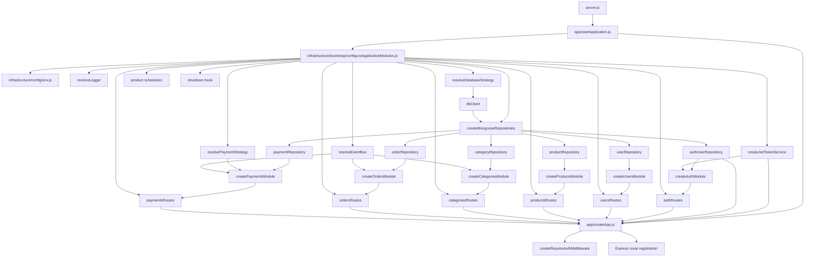
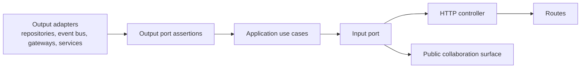
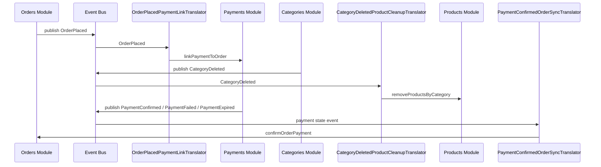
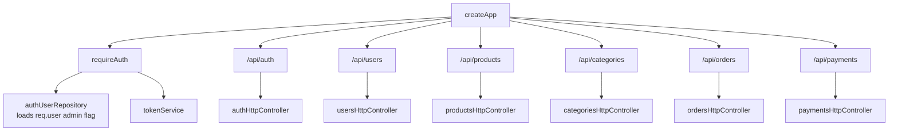

# Backend Dependency Graph

This backend is wired from `backend/src/infrastructure/bootstrap/configureApplicationModules.js`.
The composition root owns infrastructure selection, repository construction, module creation, and cross-module event subscriptions.

## Startup Wiring

## Module Shape

Each module follows the same hexagonal composition pattern: validate output ports, build use cases, wrap them in an input port, then expose HTTP routes and any collaboration surface needed by another module.

## Module Dependencies

```mermaid
flowchart TD
  AuthModule["Auth module"] --> AuthRepo["authUserRepository"]
  AuthModule --> TokenService["tokenService"]
  AuthModule --> OAuthProviders["oauthProviders"]

  UsersModule["Users module"] --> UserRepo["userRepository"]

  ProductsModule["Products module"] --> ProductRepo["productRepository"]
  ProductsModule --> ProductScheduler["newProductStatusScheduler"]

  CategoriesModule["Categories module"] --> CategoryRepo["categoryRepository"]
  CategoriesModule --> EventBus["eventBus"]

  OrdersModule["Orders module"] --> OrderRepo["orderRepository"]
  OrdersModule --> EventBus

  PaymentsModule["Payments module"] --> PaymentRepo["paymentRepository"]
  PaymentsModule --> PaymentGateway["paymentGateway"]
  PaymentsModule --> EventBus
```

## Cross-Module Event Workflows

Modules do not call each other directly. The composition root subscribes collaboration translators to the event bus, and translators invoke the receiving module public surface.

## HTTP Surface Wiring

