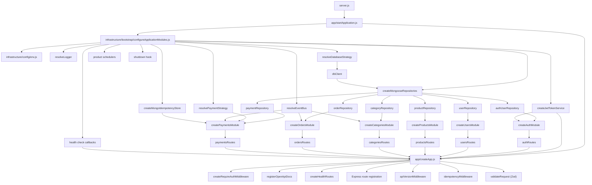
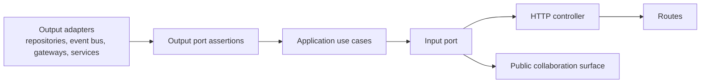
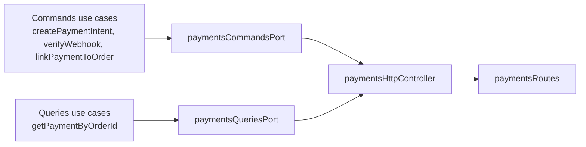
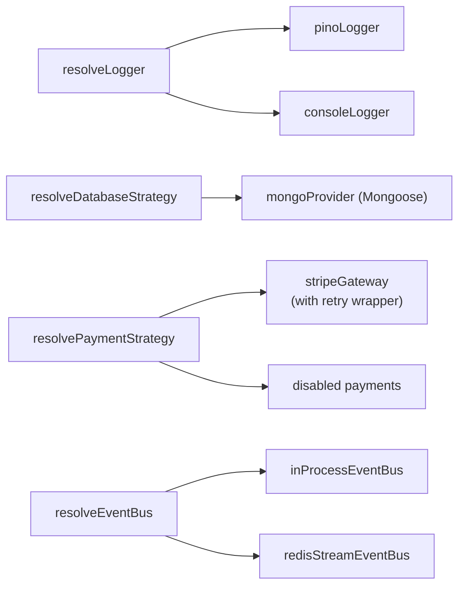
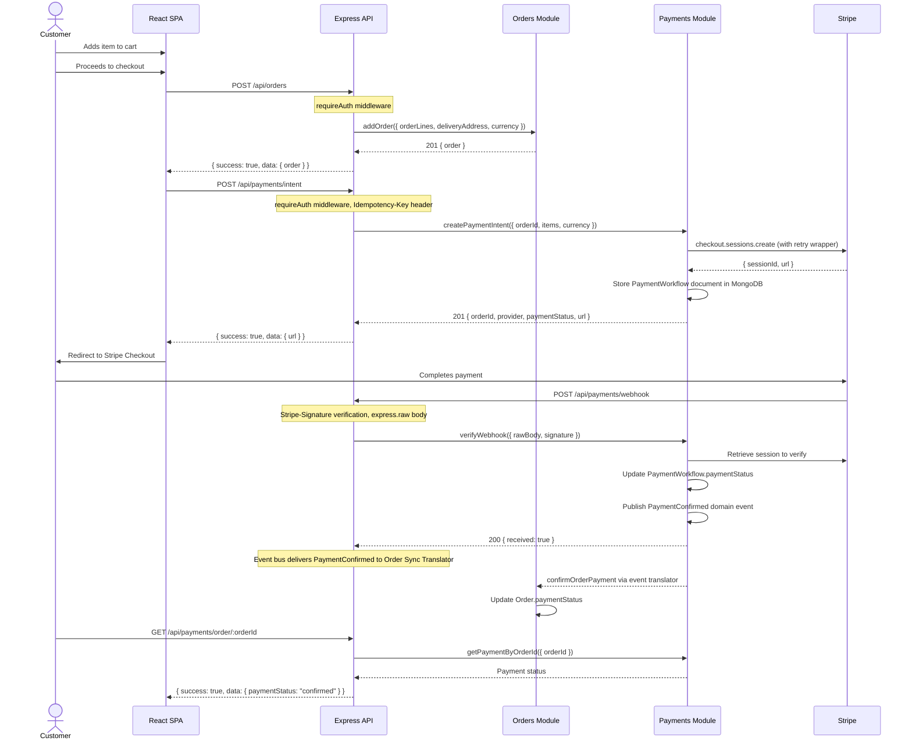

# Backend Dependency Graph

> Version 2.0.0 — Last updated: 2026-06-10

This backend is wired from `backend/src/infrastructure/bootstrap/configureApplicationModules.js`.
The composition root owns infrastructure selection, repository construction, module creation, and cross-module event subscriptions.

See [System Design Choices](./backend-system-design-choices.md) for rationale behind each architectural decision.

## Startup Wiring

## Module Shape

Each module follows the same hexagonal composition pattern: validate output ports, build use cases, wrap them in an input port, then expose HTTP routes and any collaboration surface needed by another module.

The payments module extends this with CQRS — separate input ports for commands and queries:

## Module Dependencies

```mermaid
flowchart TD
  AuthModule["Auth module"] --> AuthRepo["authUserRepository"]
  AuthModule --> TokenService["tokenService"]
  AuthModule --> OAuthProviders["oauthProviders"]

  UsersModule["Users module"] --> UserRepo["userRepository"]

  ProductsModule["Products module"] --> ProductRepo["productRepository"]
  ProductsModule --> ProductScheduler["newProductStatusScheduler"]

  CategoriesModule["Categories module"] --> CategoryRepo["categoryRepository"]
  CategoriesModule --> EventBus["eventBus"]

  OrdersModule["Orders module"] --> OrderRepo["orderRepository"]
  OrdersModule --> EventBus

  PaymentsModule["Payments module"] --> PaymentRepo["paymentRepository"]
  PaymentsModule --> PaymentGateway["paymentGateway"]
  PaymentsModule --> EventBus
  PaymentsModule --> IdempotencyStore["idempotencyStore"]
```

## Cross-Module Event Workflows

Modules do not call each other directly. The composition root subscribes collaboration translators to the event bus, and translators invoke the receiving module public surface.

## HTTP Surface Wiring

All routes are mounted at both `/api/` (legacy) and `/api/v1/` (versioned) prefixes.

```mermaid
flowchart TD
  App["createApp"] --> RequireAuth["requireAuth"]
  RequireAuth --> AuthRepo["authUserRepository\nloads req.user admin flag"]
  RequireAuth --> TokenService["tokenService"]

  App --> Versioning["apiVersion + apiDeprecationWarning"]

  App --> AuthRoutes["/api/auth, /api/v1/auth"]
  App --> UsersRoutes["/api/users, /api/v1/users"]
  App --> ProductsRoutes["/api/products, /api/v1/products"]
  App --> CategoriesRoutes["/api/categories, /api/v1/categories"]
  App --> OrdersRoutes["/api/orders, /api/v1/orders"]
  App --> PaymentsRoutes["/api/payments, /api/v1/payments"]
  App --> HealthRoutes["/health, /ready"]
  App --> OpenApiDocs["/api-docs, /api-docs/openapi.yaml"]
  App --> Metrics["/metrics (Prometheus)"]

  AuthRoutes --> AuthController["authHttpController"]
  UsersRoutes --> UsersController["usersHttpController"]
  ProductsRoutes --> ProductsController["productsHttpController"]
  CategoriesRoutes --> CategoriesController["categoriesHttpController"]
  OrdersRoutes --> OrdersController["ordersHttpController"]
  PaymentsRoutes --> PaymentsController["paymentsHttpController"]
  HealthRoutes --> HealthChecks["database, payments, event bus checks"]
```

## Infrastructure Providers

## Checkout Flow Sequence

## Documentation and Operations Surface

Swagger UI is served from `backend/src/shared/infrastructure/http/openApiDocs.js`.
The raw OpenAPI contract lives at `backend/docs/openapi.yaml` and documents all `/api/v1/*` routes plus the root-level `/health` and `/ready` endpoints.
Readiness checks are built by the composition root after provider resolution so they report the configured database, payment, and event bus adapters.
Prometheus metrics are collected at `/metrics` via `express-prom-bundle`.

---

## Revision History

| Date       | Change                                                      |
| ---------- | ----------------------------------------------------------- |
| 2026-06-10 | Added revision history, cross-link to system design choices |
| 2026-06-07 | Initial version                                             |
