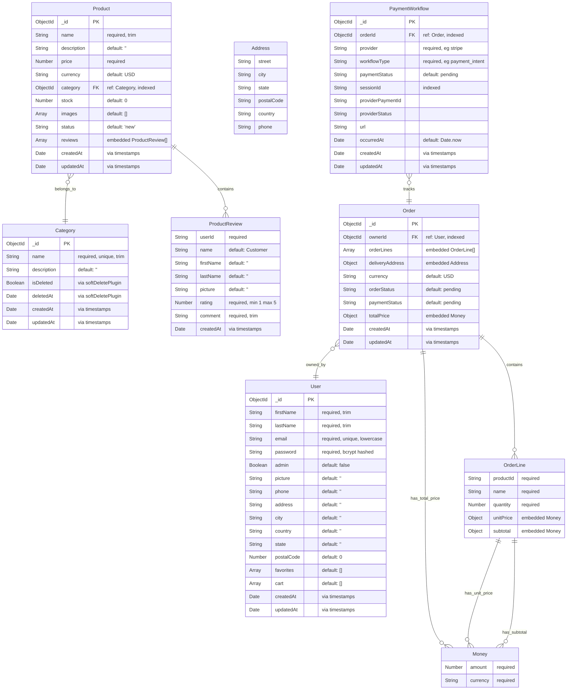

# Data Model

> Version 2.0.0 — Last updated: 2026-06-10

## Entity-Relationship Diagram

## Collection Indexes

### Users

| Index | Fields     | Unique? |
| ----- | ---------- | ------- |
| email | `email: 1` | Yes     |

### Products

| Index            | Fields                     | Notes                                            |
| ---------------- | -------------------------- | ------------------------------------------------ |
| category         | `category: 1`              | Single-field lookup                              |
| status+createdAt | `status: 1, createdAt: -1` | Compound for listing by status sorted by recency |
| price            | `price: 1`                 | For price-range queries                          |
| createdAt        | `createdAt: -1`            | For recent-products listing                      |

### Categories

| Index               | Fields                        | Unique?                       |
| ------------------- | ----------------------------- | ----------------------------- |
| name                | `name: 1`                     | Yes                           |
| isDeleted+createdAt | `isDeleted: 1, createdAt: -1` | For active-categories listing |

### Orders

| Index                   | Fields                            | Notes                            |
| ----------------------- | --------------------------------- | -------------------------------- |
| ownerId+createdAt       | `ownerId: 1, createdAt: -1`       | User's order history             |
| orderStatus+createdAt   | `orderStatus: 1, createdAt: -1`   | Admin order management by status |
| paymentStatus+createdAt | `paymentStatus: 1, createdAt: -1` | Payment reconciliation           |
| isPaid+ownerId          | `isPaid: 1, ownerId: 1`           | Filter paid/unpaid by user       |

### PaymentWorkflows

| Index     | Fields         | Notes                   |
| --------- | -------------- | ----------------------- |
| sessionId | `sessionId: 1` | Stripe session lookup   |
| orderId   | `orderId: 1`   | Payment-by-order lookup |

### System Collections

| Collection     | Index                                    | Purpose                             |
| -------------- | ---------------------------------------- | ----------------------------------- |
| `_migrations`  | `name: 1` (unique)                       | Migration tracking                  |
| `_idempotency` | `key: 1` (unique), `expiresAt: 1` (TTL)  | Idempotency store with auto-cleanup |
| `audit_logs`   | `actor+timerange`, `timestamp`, `action` | Audit trail for product mutations   |

## Schema Validation

MongoDB `$jsonSchema` validators enforce the same constraints at the database level. Defined in `backend/migrations/001-create-initial-schema.js`.

Key validations:

- **Users**: email pattern match, password minLength 6
- **Products**: price >= 0, stock >= 0, rating 1-5
- **Orders**: non-empty orderLines, valid currency codes
- **Payments**: valid paymentStatus values

## Embedded vs Referenced

| Decision                                                             | Rationale                                                                |
| -------------------------------------------------------------------- | ------------------------------------------------------------------------ |
| **ProductReview** embedded in Product                                | Reviews are always fetched with the product, never queried independently |
| **OrderLine** embedded in Order                                      | Lines are part of the order aggregate, never exist independently         |
| **Money** embedded inline                                            | Simple value object, no standalone queries                               |
| **Address** embedded                                                 | Always part of an order, no address book feature                         |
| **User, Category, Product, PaymentWorkflow** as separate collections | Queried independently, referenced by ObjectId                            |

---

## Related Documents

- [Functional Requirements](../functional-requirements.md) — business rules per entity
- [Configuration Reference](../configuration.md) — database connection settings
- [ADR-005: Database Provider Abstraction](../adr/005-database-abstraction.md) — Mongo/Postgres dual-provider design

## Revision History

| Date       | Change                                                   |
| ---------- | -------------------------------------------------------- |
| 2026-06-10 | Added revision history, cross-links to related documents |
| 2026-06-07 | Initial version                                          |
